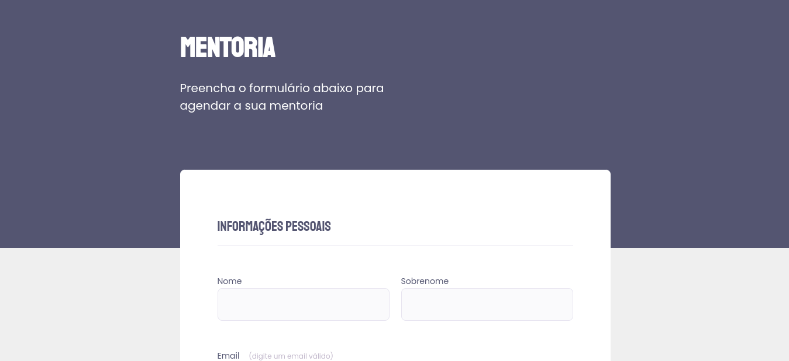

  

## 🚀 Tecnologias

Esse projeto foi desenvolvido com as seguintes tecnologias:

- [HTML](https://developer.mozilla.org/pt-BR/docs/Web/HTML)
- [CSS](https://developer.mozilla.org/pt-BR/docs/Web/CSS)

## 💻 Projeto

O projeto Rocket.mentorship é site para cadastramento de mentorias, ele foi elaborado no desafio do Stage03 no programa Explorer da Rocketseat.

- [Página](https://leokazuyukinagatani.github.io/rocket-mentorship//)

## 🔖 Layout

No link abaixo você encontra o layout do projeto web. Lembrando que você precisa ter uma conta no [Figma](http://figma.com/) para acessá-lo.

- [Layout Web](https://www.figma.com/file/7H4PgRXORGP1i4pA14emCb/Stage-03---Formul%C3%A1rio-intermedi%C3%A1rio-(Copy)?node-id=0%3A1)

----

https://www.figma.com/file/yMVBsKB1kXkEtmqINzOn0o/Stage-03---Formul%C3%A1rio-avan%C3%A7ado-(Copy)?node-id=0%3A1
